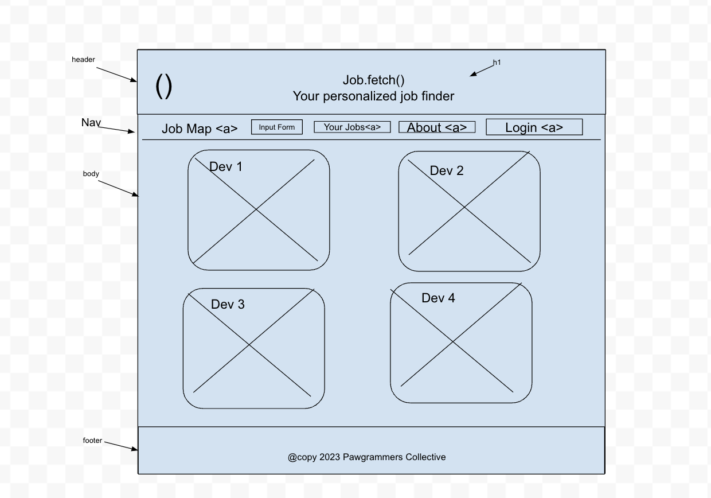
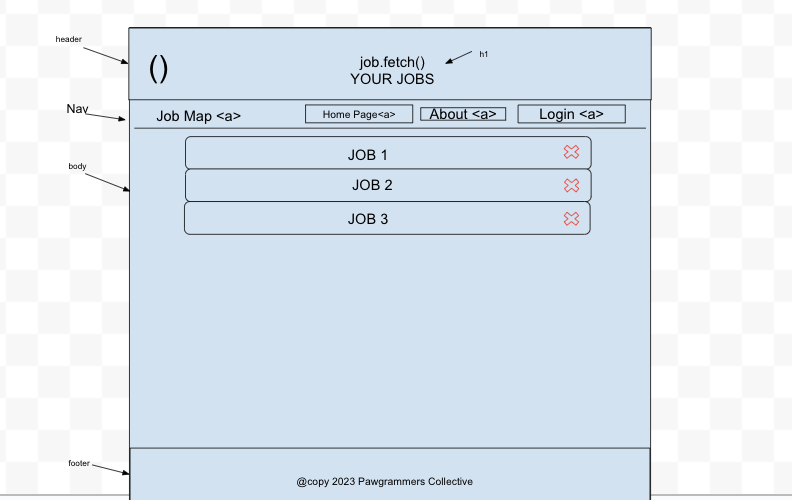
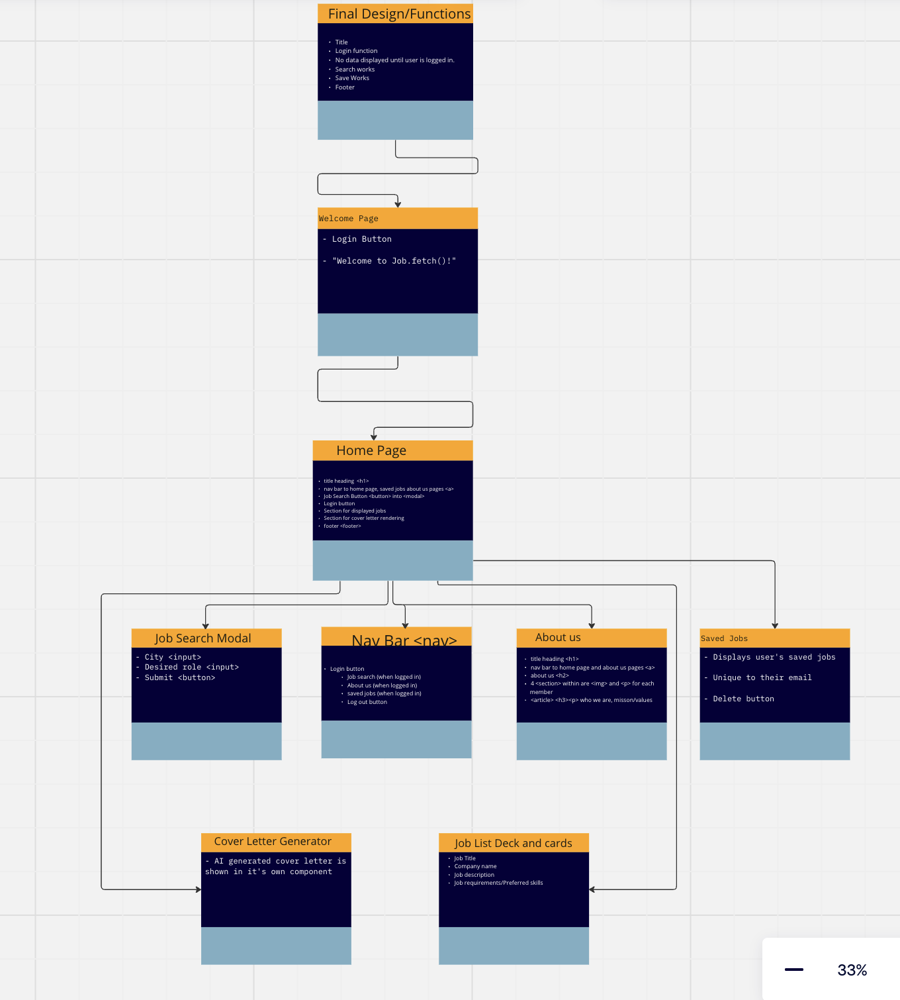

# Job.fetch( )

## Group Members

Kyle Aleman, Johnny Backus, Xin Deng, Brendan Huddleston

### Summary of idea:

The project is a comprehensive tech career preparation and job search engine that integrates job search functionalities, resume building, interview preparation, and career coaching features. Leveraging AI, the platform generates interview questions and cover letters based on job descriptions and uploaded resumes. This all-in-one solution aims to streamline the tech job search process, enhance candidate preparation, and provide personalized career coaching.

### What problem or pain point does it solve?

The platform addresses the challenges faced by tech job seekers, offering a centralized hub for job search, resume building, and interview preparation. It solves the pain points of scattered resources, lack of personalized guidance, and the time-consuming nature of tailoring application materials for specific job opportunities.

### Minimum Viable Product (MVP) definition.

The platform should demonstrate the key features of job search, filtering, and saving, as well as the AI-driven interview question and cover letter generation.


### Wireframes 

1. Homepage Wireframe


2. About Us Wireframe


3. About Us Wireframe


### User Stories

1. Trello Board


1. Login authentication

    - User Story sentence
      - As a user, I want to log in into my google account and be able to see my   personalized data.
    - Feature Tasks
      - When a job is saved the user will be able to log out, then log back in and still display the users saves.
      - The user will have a customized web page when logged in.
    - Acceptance Tests
      - login with Auth0 works properly.
      - Users data gets displayed
      - Save page displays the users job saves.
    - Estimate your User Stories: 1 day


1. Job Search

    - User Story sentence
      - As a user, I want to be able to search for tech jobs based on job titles.
    - Feature Tasks
      - Create a search bar to send params to the api call.
      - Create other options to send as params for the api call.
      - Create a react bootstrap accordion for the return of the api call.
    - Acceptance Tests
      - Search bar returns data that is correct to the search parameter.
      - There is at least one filter for the data that gets returned.
      - The accordion works properly.

    - Estimate your User Stories: 1-2 days 


3. Job Save

    - User Story sentence
      - As a user, I want to be able to save any of the jobs from my job search.
    - Feature Tasks
      - When saved, the job will be added to the database.
      - When saved, the saved job will be displayed in the saved jobs section.
    - Acceptance Tests
      - Save a job and check if it displays on the save page.
      - Check to see if every save is being added to the database.
    - Estimate your User Stories: 1 day

4. LeetCode

    - User Story sentence
      - As a user, I want to practice interview whiteboard code questions. 
    - Feature Tasks
      - Be able to select a difficulty.
      - Leetcode questions will be displayed on the screen.
	- Identify if the user got a question correct.

    - Acceptance Tests
      -Have a leetcode question be displayed.
      - Be able to submit an answer to the question.
      - Be able to select a difficulty.
    - Estimate your User Stories: 1 day.

1. AI Interview Questions

    - User Story sentence
      - As a user, I want to be able to practice tech interview questions.
    - Feature Tasks
      - Hit a button and get a prompt back in the form of an interview question.
      - Be able to respond to the prompt and get feedback
    - Acceptance Tests
      - Prompt appears when a button is pressed.
    - Response bar is provided.
	- Some sort of user feedback based on the response.
    - Estimate your User Stories - 1 day


### Domain Modeling 

```
Draw out the entities for your project and how they are related to each other. Determine the relationships between the functions/methods and entities of your app.

Include in your domain model the names and data types of your entities and their properties.
```


1. Domain Model



<!-- ### Using a Database? Make an Database Schema Diagram ?

If you are using a database of any kind in your project, draft out what your schema will look like by creating a diagram of all your application data models, each in it’s own collection (or table).

Be sure to identify the relationships (if any) between each of your data models:

1. Does a single item in your database “belong to” just one other item in your database? For example, a person has one passport, and a passport belongs to a single person.
1. Does a item in your database “belong to” multiple other items in your database? For example, a house has many residents, and each resident has one primary house.
1. Do many items in your database relate to many other items in your database? For example, a band has many musicians, and a musician can be in many bands.

Also, include for each separate collection:

1. The name of each property stored in the collection.
1. The required data type.
1. An indication if this collection is associated with another collection.

Include this diagram in your readme, accompanied by an explanation of each data model and it’s responsibility in the application. -->

Diagram?

We will be using MongoDB: a non-SQL database that uses documents usually in JSON or BSON format. We anticipate only needing one collection within our database though it may be bested with multiple objects and arrays.
Collection 1 Users
	Name: String
	Auth0 info: Object
	Saved Search: Object
	Saved Jobs: Array
	Saved Interview Q Responses: Array
	Resume: Object??
	Saved Cover Letters: Array??


